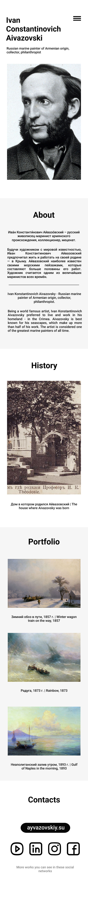

# Aivazovski Landing Page

Учебный проект - одностраничный сайт, посвященный творчеству известного художника-мариниста Ивана Айвазовского.

## Демо

## Технологии

- HTML5
- CSS3
  - Flexbox
  - CSS Variables
  - Media Queries
  - Responsive Design

## Функционал

- Адаптивная верстка для desktop и mobile устройств
- Мобильное меню-бургер
- Плавный скролл к разделам
- Hover-эффекты на интерактивных элементах
- Оптимизированные изображения (WebP формат)

## Автор

- [@yupi-pot](https://github.com/yupi-pot)

## Лицензия

This project is licensed under the MIT License - see the [LICENSE](LICENSE) file for details.
